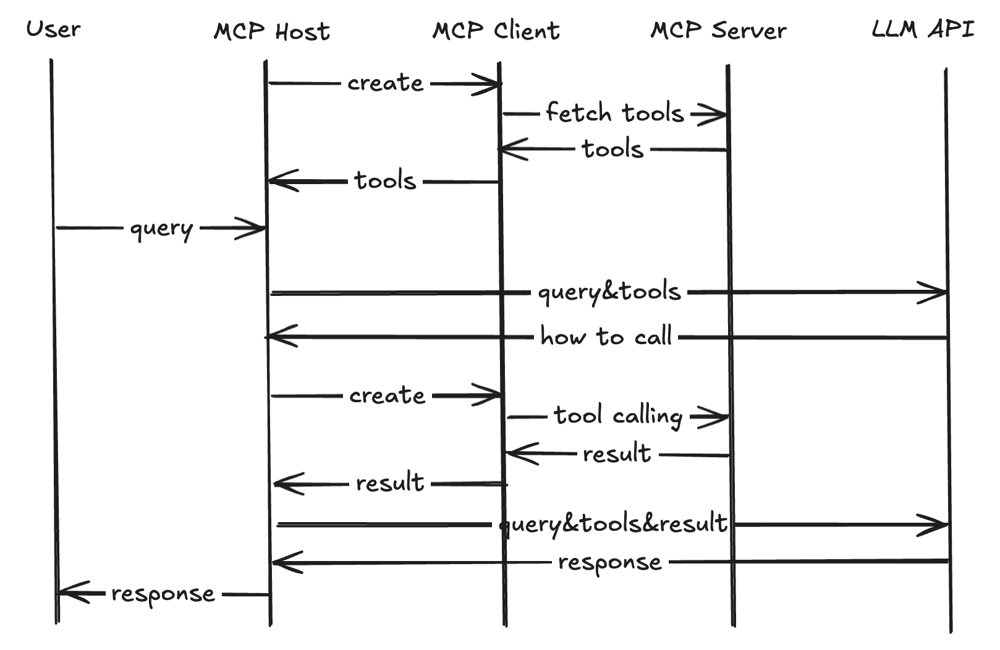

MCP（Model Context Protocol）基于客户端-服务器架构，使用JSON-RPC 2.0消息协议，支持工具调用、资源访问、提示模板和LLM采样等核心功能，标准化了AI应用与外部数据源和工具的连接方式。

### 流程交互图
MCP Host 会启动和 MCP Server 对应的 MCP Client

### 参考链接
- 官方文档：https://modelcontextprotocol.io/introduction
- 较友好的一个中文教程：https://www.claudemcp.com/zh/docs/write-ts-server
- 远程mcp服务：https://blog.cloudflare.com/remote-model-context-protocol-servers-mcp/
- mcp服务站点：https://mcp.so/