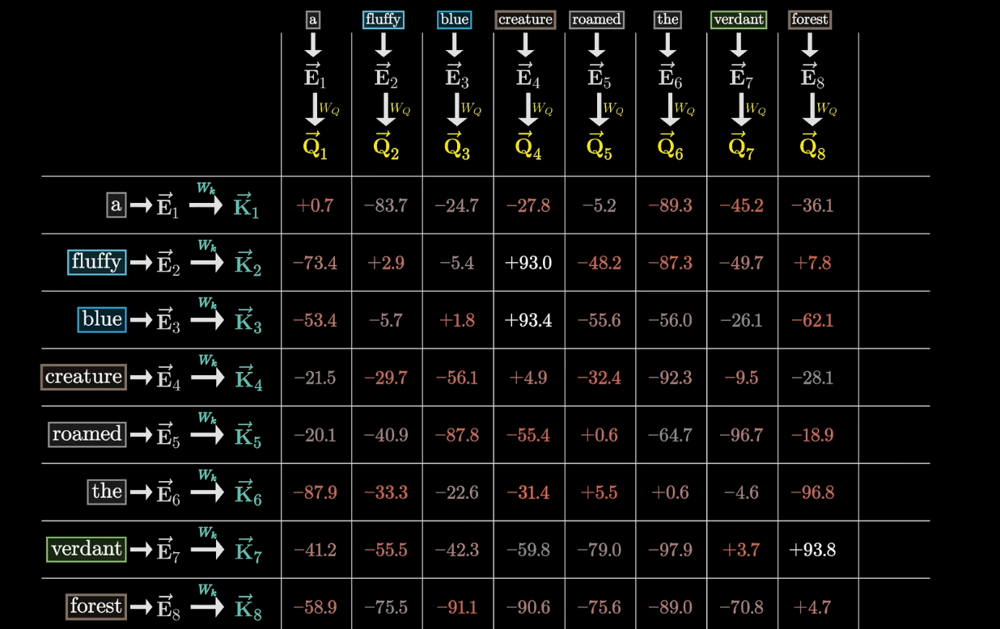
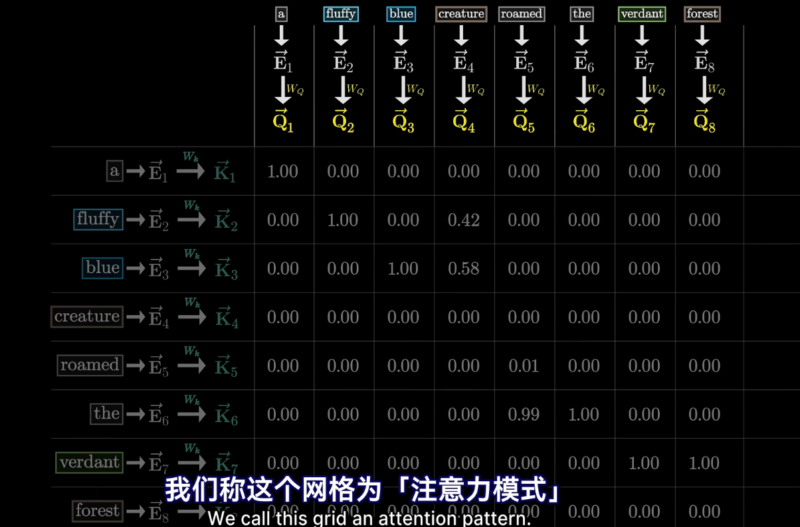
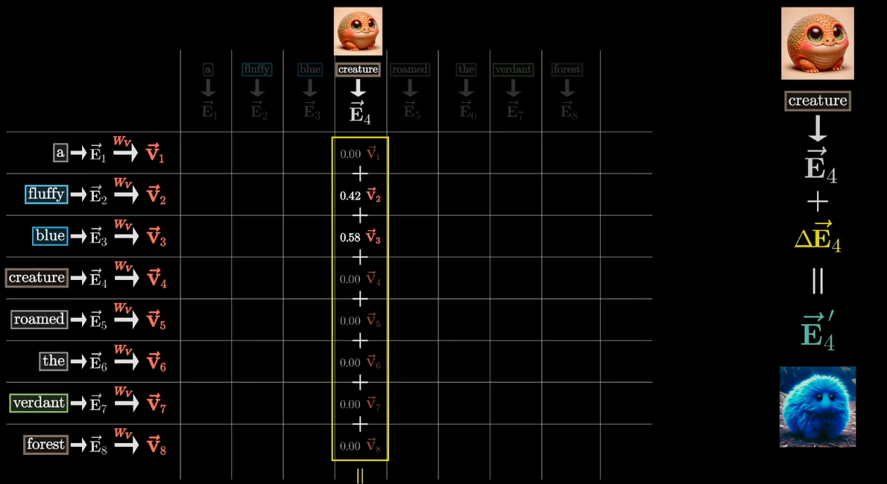

### 自注意力机制

Q 向量: 由输入 xi 左乘一个权重矩阵 Wq 得到
K 向量: 由输入 xi 左乘一个权重矩阵 Wk 得到
V 向量: 由输入 xi 左乘一个权重矩阵 Wv 得到

QK^T: Q 向量与 K 向量的点积，得到相关性矩阵

在对每一列都经过 softmax 之后得到了注意力模式

当然为了防止后面的词对前面的词的影响，我们会采取注意力掩码，也就是将注意力模式矩阵中主对角线以下的元素全部置为负无穷

最后会将缩放后的注意力模式矩阵与 V 向量相乘，得到加权后的 V 向量，就得到了涵盖了丰富的上下文信息的新的输入向量
这个新的输入向量也会包含初始的输入向量 xi 的信息，也是一种残差的思想

参考：https://www.bilibili.com/video/BV1TZ421j7Ke/