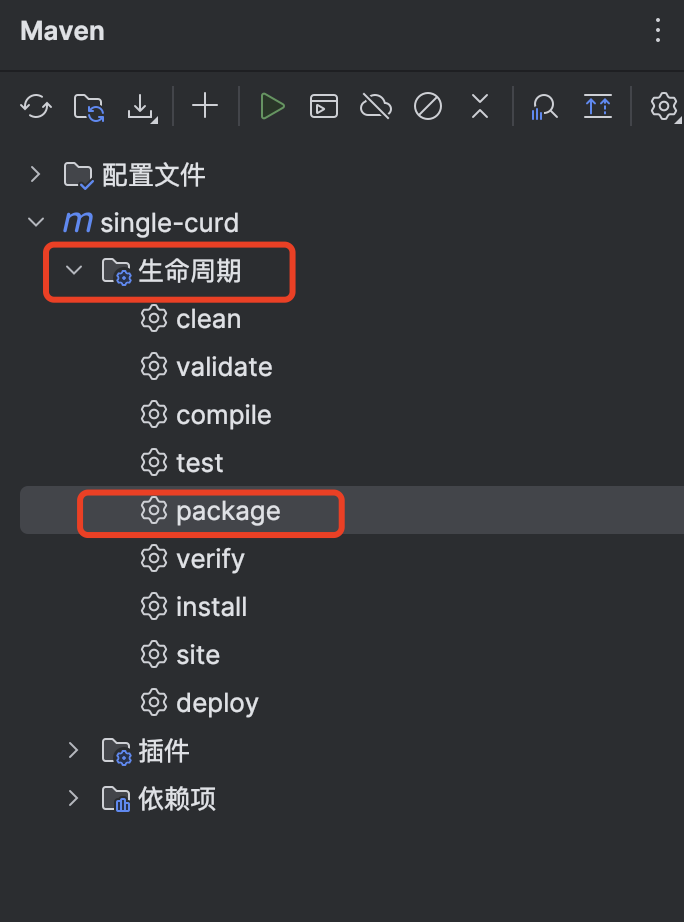

### maven打包


### 编写Dockerfile
```Dockerfile
# 使用 OpenJDK 17 作为基础镜像
FROM openjdk:17

# 设置工作目录
WORKDIR /app

# 将 JAR 包复制到镜像中
COPY app.jar /app/app.jar

# 暴露端口
EXPOSE 8071

# 设置启动命令
ENTRYPOINT ["java", "-jar", "app.jar"]

```

### 构建镜像
```bash
docker build -t my-springboot-app .
```

### 运行容器
```bash
docker run -p 8071:8071 my-springboot-app
```

### 访问项目
http://localhost:8071
