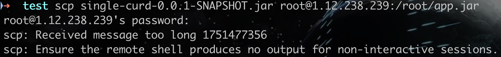
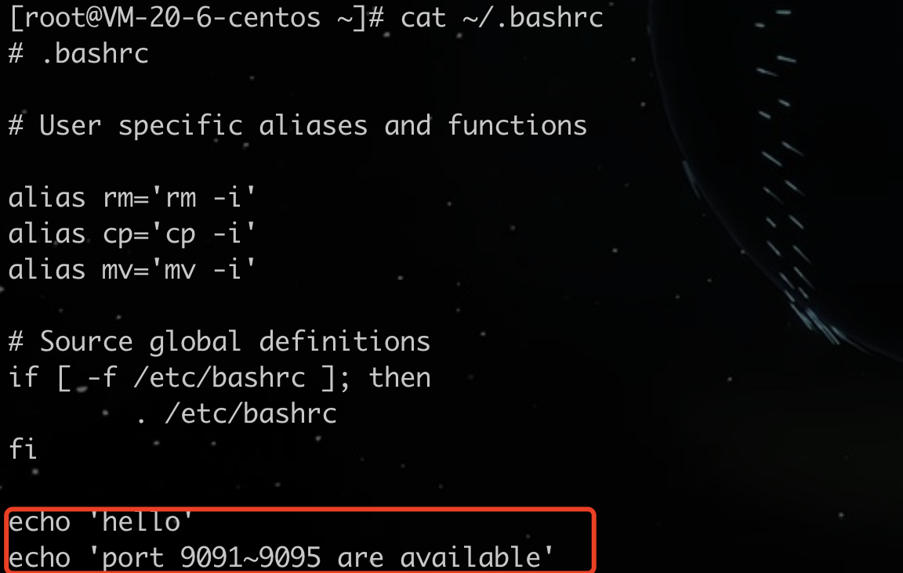

### MacOS 通过 SCP 上传文件到 Linux 云服务器
参考：
https://cloud.tencent.com/document/product/213/2133

#### 踩坑

解决参考：
https://blog.csdn.net/qq_43413788/article/details/130366891

确实是之前在云服务器的./bashrc文件中写了echo命令导致scp报错的，去除之后就可以正常上传了。

