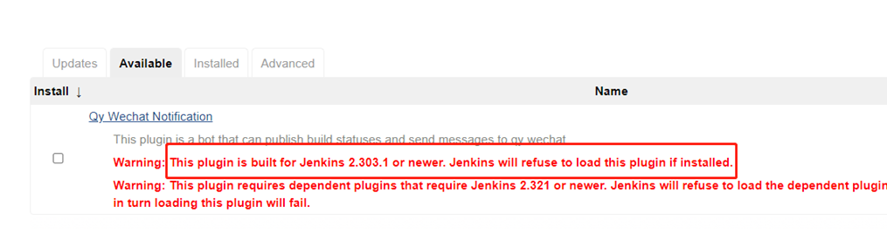
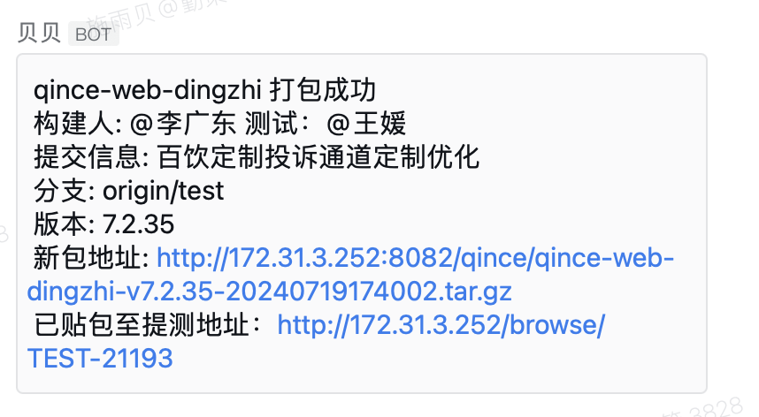

### 背景
前端打包提测的流程如下:
1. 在jenkins上进行构建
2. 需要人为检查Jenkins上是否构建完成
3. 构建完成后，将生成的压缩包链接手动复制到jira对应test任务的评论区
4. 将生成的压缩包链接手动复制到企微，发给对应测试人员

Jenkins版本过低无法使用网上常用的jira插件、企业微信插件以及Build user vars插件


### 解决方案
直接在构建阶段的脚本中
1. curl调用jira的api
2. curl调用企业微信机器人的webhook地址
3. curl调用jenkins的api获取构建人信息

### 最终效果
在打包完成后在群里发通知如下图所示：


### 构建脚本部分内容

```shell
# 生成文件
tar -zcvf  ../distpack/package_name-v${version}-${packagedate}.tar.gz web

BUILD_CAUSE_JSON=$(curl --silent -u xxx:xxx ${BUILD_URL}api/json | tr "{}" "\n" | grep "shortDescription")
BUILD_USER_ID=$(echo $BUILD_CAUSE_JSON | tr "," "\n" | grep "userId" | awk -F\" '{print $4}')
BUILD_USER_NAME=$(echo $BUILD_CAUSE_JSON | tr "," "\n" | grep "userName" | awk -F\" '{print $4}')

sendMsg() {
        #群聊机器人地址
        WEBHOOK_URL="xxx"
        fileHost='xxx'
        message=''
        if [ "$1" == true ]; then
                filepath="${fileHost}package_name-v${version}-${packagedate}.tar.gz"
                echo "filepath: ${filepath}"
                message="打包成功 @${BUILD_USER_NAME} \n 分支: ${branchName} \n 版本: ${version} \n 新包地址: ${filepath}"
                if [ ${branchName} == "test" ]; then
                    testpath="xxx"
                    # 发送到JIRA
                    curl -X POST \
                      http://host/rest/api/latest/issue/TEST-xxx/comment \
                      -H 'Authorization: Basic xxx' \
                      -H 'Content-Type: application/json' \
                      -d "{\"body\": \"${filepath}\"}"
                    message="${message} \n 已贴包至提测地址：${testpath}"
                fi;
        else 
            message="打包失败 @${BUILD_USER_NAME} \n 分支: ${branchName} \n 版本: ${version} \n 日志: ${BUILD_URL}console"
        fi
        # 群聊机器人提醒
        curl --location --request POST ${WEBHOOK_URL} \
        --header 'Content-Type: application/json' \
        -d "{\"msgtype\": \"text\",\"text\": {\"content\": \"package_name \n ${message}\"}}"
}
```

注：
1. Authorization中basic后是 {jira的用户名:密码} 的 base64编码
2. 请求${BUILD_URL}api/json时需要jenkins的用户名密码
3. 在获取构建人信息时grep "shortDescription"而不是网上的grep "Start by"，是因为公司里的jenkins里是中文“由 xxx 启动”，匹配不到Start by
4. BUILD_USER_ID并不是企业微信机器人艾特群成员所需的userid，这个userid只有企微的管理员权限才能获取到，因此暂时并未实现真正艾特构建人，只是在message中用@字符拼接了BUILD_USER_NAME
