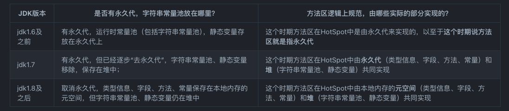

## 总览
线程不共享的：
- 程序计数器
- java虚拟机栈
- 本地方法栈

线程共享的：
- 方法区
- 直接内存（堆外内存）不属于jvm管理的内存
- 堆

## 程序计数器

## java虚拟机栈

## 本地方法栈

## 方法区
方法区只是 JVM 规范中定义的一个概念，用于存储类信息、运行时常量池、静态变量、JIT编译后的代码等数据，并没有规定如何去实现它，不同的厂商有不同的实现。

具体可参考https://zhuanlan.zhihu.com/p/670640078
## 堆

