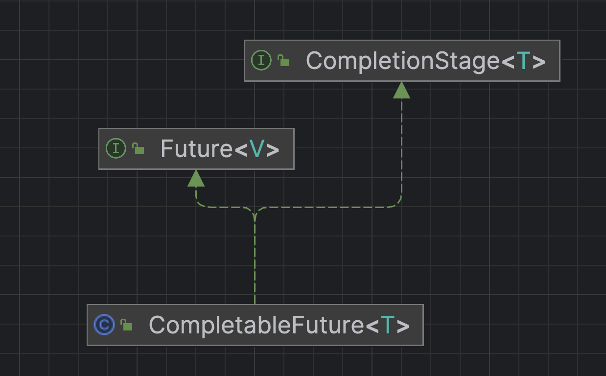

### Executor框架总览

### Future

分析 FutureTask 是否使用了适配器模式

FutureTask实现了RunnableFuture接口，而RunnableFuture接口继承自Runnable和Future接口。Callable接口和Runnable接口都用于定义任务相关的操作，但Callable有返回值，Runnable没有。
FutureTask在这里起到了一个接口转换的作用。它将Callable类型的任务包装起来，使其能够适应Runnable接口的使用场景（因为FutureTask实现了Runnable，可以被Thread执行），同时又保留了Future接口提供的获取结果、检查任务状态等功能。从这个意义上说，它有点像适配器模式，将Callable任务适配到了Runnable和Future的联合接口环境中。



### 线程池
ThreadPoolExecutor线程池原理讲解参考：

- https://tech.meituan.com/2020/04/02/java-pooling-pratice-in-meituan.html
- https://javabetter.cn/thread/pool.html
- https://pdai.tech/md/java/thread/java-thread-x-juc-executor-ThreadPoolExecutor.html
### 项目应用场景: 多个文件复制到指定目录
可简化为demo如下:
```java
package org.example;

import java.util.Arrays;
import java.util.List;
import java.util.concurrent.*;
import java.util.concurrent.atomic.AtomicInteger;

public class Main {
    public static void main(String[] args) {
        long start = System.currentTimeMillis();
        // 模拟任务列表，这里假设任务是打印数字
        Integer[] taskList = {1, 2, 3, 4, 5};
        // 创建一个固定大小的线程池
        ExecutorService executorService = Executors.newFixedThreadPool(3);
        AtomicInteger copyCount = new AtomicInteger(0);
        List<CompletableFuture<Void>> completableFutures =
                Arrays.stream(taskList).map(num -> CompletableFuture.runAsync(() -> {
                            try {
                                int sleepTime = ThreadLocalRandom.current().nextInt(1000, 3001);
                                Thread.sleep(sleepTime);
                                copyCount.incrementAndGet();
                            }
                            catch (InterruptedException e) {
                                System.out.println("Task " + num + " interrupted");
                            }
                            }, executorService)).toList();
                    
        CompletableFuture<Void> allFutures = CompletableFuture.allOf(completableFutures.toArray(new CompletableFuture[0]));
        allFutures.join();
        System.out.println("All tasks completed, copyCount: " + copyCount.get() + " cost time: " + (System.currentTimeMillis() - start));
        executorService.shutdown();
    }
}
```
CompletableFuture.allOf方法用于将多个CompletableFuture对象组合在一起，等待所有这些CompletableFuture对象都完成后才继续执行后续操作。它返回一个新的`CompletableFuture<Void>`，这个新的CompletableFuture本身并不包含实际的计算结果，而是用于表示所有组合的CompletableFuture都已完成的状态。

与之配套的方法还有CompletableFuture.anyOf，用于等待任意一个CompletableFuture完成。

CompletableFuture.allOf方法接受可变参数形式的参数列表，在上面的例子中不能直接传入completableFutures，因为`List<CompletableFuture<Void>>`是一个列表类型，它和可变参数形式所期望的数组形式（即使列表元素类型是`CompletableFuture<?>`）在类型上是不匹配的。
```java
public static CompletableFuture<Void> allOf(CompletableFuture<?>... cfs)
```

