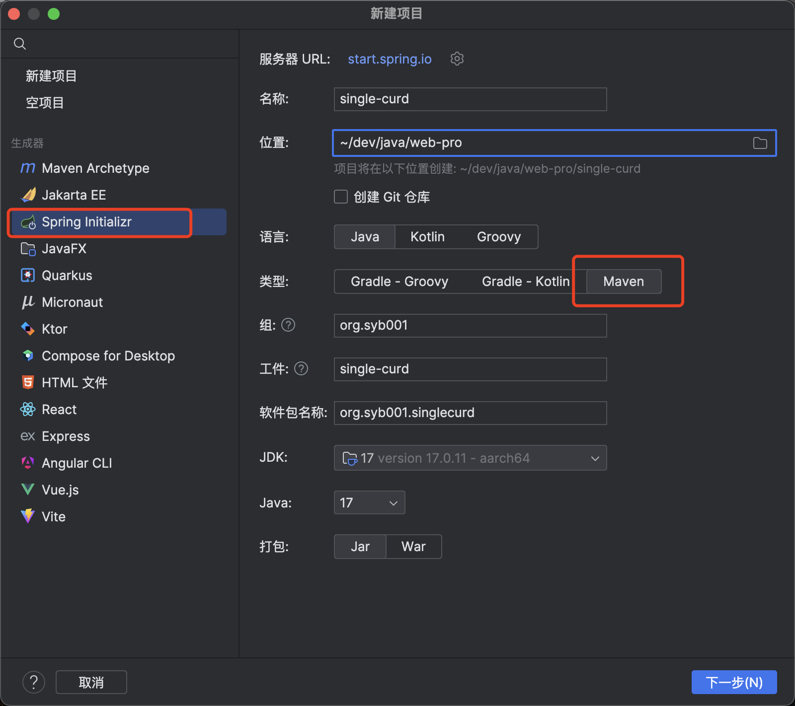

https://www.bilibili.com/video/BV1j94y1W71m

## 简介
使用spring initializr快速搭建三层架构项目，集成mybatis完成单表CRUD

github地址：https://github.com/frontStudent/springboot-single-curd

### spring initializr项目初始化


两种server url的区别：
- https://start.spring.io  只能选择java17及以上的版本
- https://start.aliyun.com 可以选择java8及以上

集成依赖：


### resources目录下application.yml文件配置
```yml
server:
  port: 8071
spring:
  datasource:
    username: root
    password: abc740531
    url: jdbc:mysql://localhost:3306/hello?useUnicode=true & characterEncoding=utf-8 &
      useSSL=true & serverTimezone=Asia/Shanghai
    driver-class-name: com.mysql.cj.jdbc.Driver

mybatis:
  # Mybatis 配置文件的位置
  mapper-locations: classpath:/mapper/*.xml

  # 开启 Mybatis 的驼峰命名规则自动映射功能
  # 这样就可以将数据库中下划线命名的字段自动映射到实体类的驼峰命名属性上
  configuration:
    map-underscore-to-camel-case: true

  # 配置后可以在 XML 映射文件中直接使用类名,无需指定完整的包名路径
  type-aliases-package: com.example.demo.pojo
```

### 持久层
这里使用mybatis时采用了注解方式和xml方式混用，稍复杂的查询使用了xml方式

```java
package org.syb001.singlecurd.mapper;

import org.apache.ibatis.annotations.*;
import org.springframework.stereotype.Repository;
import org.syb001.singlecurd.dto.request.UserQueryDto;
import org.syb001.singlecurd.pojo.User;

import java.util.List;

@Mapper
@Repository
public interface UserMapper {

    List<User> getUserByCondition(UserQueryDto userQueryDto);

    @Insert("insert into test_user(username) values(#{username})")
    Integer addUser(String username);

    @Update("update test_user set username = #{username} where id = #{id}")
    Integer updateUser(Integer id, String username);

    @Delete("delete from test_user where id=#{id}")
    Integer deleteUser(Integer id);
}
```

resources/mapper/userMapper.xml
```xml
<?xml version="1.0" encoding="UTF-8" ?>
<!DOCTYPE mapper
        PUBLIC "-//mybatis.org//DTD Mapper 3.0//EN"
        "http://mybatis.org/dtd/mybatis-3-mapper.dtd">
<mapper namespace="org.syb001.singlecurd.mapper.UserMapper">
    <select id="getUserByCondition" resultType="User">
        select * from test_user
        <where>
            <if test="id != null">
                and id = #{id}
            </if>
            <if test="username != null">
                and username = #{username}
            </if>
            <if test="startTime != null">
                and create_time >= #{startTime}
            </if>
            <if test="endTime != null">
                and create_time &lt;= #{endTime}
            </if>
        </where> order by update_time desc
    </select>
</mapper>
```

这边有两个注意点：
1. 用mybatis动态SQL的where标签处理多个查询条件拼接，当查询条件为空时，where标签会自动去掉and
2. xml中用&lt;符号替换小于号避免报错
https://blog.csdn.net/weixin_44443884/article/details/114624744

### pojo
```java
package org.syb001.singlecurd.pojo;

import com.fasterxml.jackson.annotation.JsonFormat;
import lombok.AllArgsConstructor;
import lombok.Data;
import lombok.NoArgsConstructor;

import java.time.LocalDateTime;

@Data
@NoArgsConstructor
@AllArgsConstructor
public class User {
    private Integer id;
    private String username;

    @JsonFormat(pattern = "yyyy-MM-dd HH:mm:ss")
    private LocalDateTime createTime;

    @JsonFormat(pattern = "yyyy-MM-dd HH:mm:ss")
    private LocalDateTime updateTime;
}

```

### 业务层
业务层下一般分为Impl实现类和接口

### 异常处理
#### 自定义异常类
在exception包下新建BizException类，继承RuntimeException
之后可以在idea中使用command + n快捷键重写相关方法


代码如下：
```java
package org.syb001.singlecurd.common.exception;


import lombok.Data;
import org.syb001.singlecurd.common.enums.ErrorEnum;

@Data
// 插入用户时 用户名重复异常
public class BizException extends RuntimeException {
    private String errorCode;
    public BizException() {
        super();
    }

    public BizException(String message) {
        super(message);
    }

    public BizException(String errorCode, String message) {
        super(message);
        this.errorCode = errorCode;
    }

    public BizException(ErrorEnum errorEnum) {
        super(errorEnum.getMessage());
        this.errorCode = errorEnum.getCode();
    }

    public BizException(String message, Throwable cause) {
        super(message, cause);
    }

    public BizException(Throwable cause) {
        super(cause);
    }

    protected BizException(String message, Throwable cause, boolean enableSuppression, boolean writableStackTrace) {
        super(message, cause, enableSuppression, writableStackTrace);
    }
}
```

#### 异常错误码与错误信息枚举类

#### 全局异常处理类

### dto
update和add的dto只相差一个id，可以使用同一个dto进行分组校验，也可以用update的dto继承add的dto

#### 引入validation进行校验

https://segmentfault.com/a/1190000023471742

- @NotNull
适用于基本数据类型(Integer，Long，Double等等)，当 @NotNull 注解被使用在 String 类型的数据上，则表示该数据不能为 Null（但是可以为 Empty）
- @NotBlank
适用于 String 类型的数据上，加了@NotBlank 注解的参数不能为 Null 且 trim() 之后 size > 0
- @NotEmpty
适用于 String、Collection集合、Map、数组等等，加了@NotEmpty 注解的参数不能为 Null 或者 长度为 0

#### 响应结果封装
```java
package org.syb001.singlecurd.dto.response;
import lombok.AllArgsConstructor;
import lombok.Data;
import lombok.NoArgsConstructor;

// 给前端的统一响应结果
@Data
@NoArgsConstructor
@AllArgsConstructor
public class Result<T> {
    private String code;
    private String message;

    private T data;

    public static <T> Result<T> success(String message, T data){
        return new Result<T>("SUCCESS", message, data);
    }

    public static <T> Result<T> fail(String message, T data){
        return new Result<T>("FAIL", message, data);
    }
}
```

静态方法中使用泛型


```java
package org.syb001.singlecurd.common.enums;

public enum ErrorEnum {
    USER_DUPLICATE("USER_DUPLICATE", "用户名已被占用"),
    USER_NOT_FOUND("USER_NOT_FOUND", "用户不存在");

    private final String code;
    private final String message;

    // 枚举的构造函数
    ErrorEnum(String code, String message) {
        this.code = code;
        this.message = message;
    }

    // 获取错误码
    public String getCode() {
        return code;
    }

    // 获取错误消息
    public String getMessage() {
        return message;
    }
}
```

在 Java 枚举中，通常建议枚举的字段应该是 final 的。否则idea会提示`枚举 'ErrorEnum' 中存在非 final 字段`

这是因为枚举实例的字段在实例化后不应该被修改。枚举值通常表示一组固定的常量，因此其内部状态也应该是不可变的。