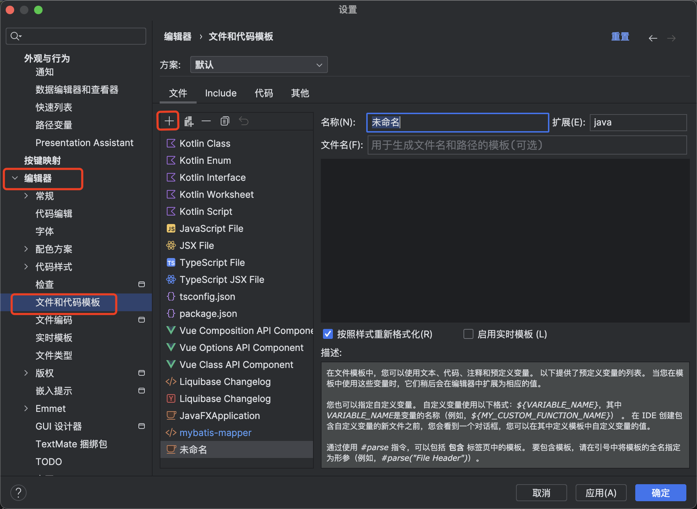

## idea

### 数据库管理工具

可参考：https://www.bilibili.com/video/BV1vN411Z7VY/?vd_source=68709e39b3ba5e45790ea12b43d6f8eb

### 文件新建模板
先command + , 打开设置，然后按照下图操作

### debug
可参考：https://blog.csdn.net/qq_44231797/article/details/132941997