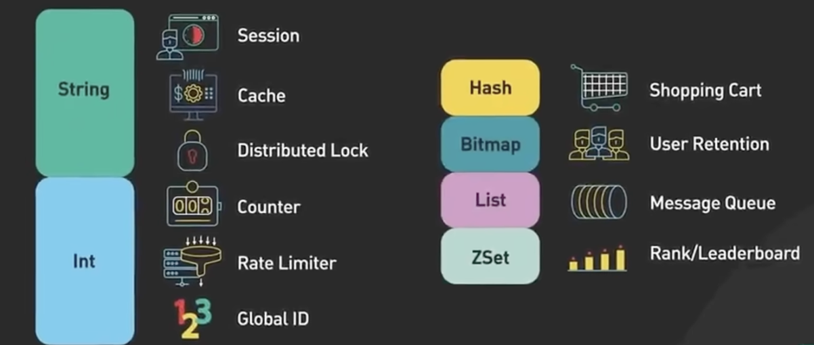

## 排行榜
## 接口限流

### 踩坑
springboot 拦截器中无法注入 RedisTemplate

解决：修改拦截器配置代码
```java
@Configuration
public class WebConfig implements WebMvcConfigurer {
 
    @Bean
    public AccessLimitInterceptor getSessionInterceptor() {
        return new AccessLimitInterceptor();
    }
 
    @Override
    public void addInterceptors(InterceptorRegistry registry) {
        registry.addInterceptor(getSessionInterceptor()).addPathPatterns("/accessLimit/*");
    }
}
```
参考：https://blog.csdn.net/weixin_40910372/article/details/103824720