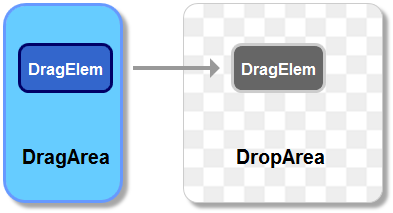

## 如何实现一个可移动、可拖放、可缩放、可编辑的文本框组件

### 需求背景
在思维导图、在线简历、产品原型等制作网站/app中，都会将文本框从工具区域拖放到画布区域之后进行移动、形状拉伸、编辑等操作 本文就将探讨如何开发一个文本框组件去满足上述场景的需求

#### 基本功能描述
1. 在工具区域点击文本框按钮后，会复制出一个跟随鼠标移动的组件，并能够拖放至画布
2. 拖放至画布后，鼠标单击时进入可移动&可缩放状态，但不可超出画布范围
3. 拖放至画布后，鼠标双击时进入可编辑状态
4. 拖放至画布后，鼠标点击其他区域退出上述状态

#### 功能细节描述
可移动的三个进阶功能：
- 显示和画布中其他元素边界/中心的对齐辅助线
- 在画布范围内支持框选多个元素进行批量移动
- 支持设置最大最小移动范围/不可超出父元素区域

可缩放的两种模式：
- 鼠标移至目标div边缘时，光标变为对应的箭头以指示拉伸的具体方向
- 在四个角和四个边的中点绘出八个指示点， 鼠标移至指示点时，光标才会变为对应的箭头

### 框架依赖
虽然技术栈依赖vue3，但在实现功能时基本都是借助的浏览器原生dom事件，只不过利用vue提供的自定义指令去进行了一些逻辑封装便于复用。

### 基本思路
可复制：
cloneNode API
可拖放：
html drag&drop API
可移动：
css transform属性
可缩放：
css transform属性
可编辑：
html contenteditable属性

### 个人项目地址
npm包地址：https://www.npmjs.com/package/vue-drag-drop-transformer
github仓库地址：https://github.com/frontStudent/vue-drag-drop-transformer.git

### 其他开源代码实现
- 参考链接1 https://www.zhihu.com/question/449608492
看这个问题下的一个回答，没有使用框架，就是原生的html+css+js去实现的。

- 参考链接2 https://github.com/a7650/vue3-draggable-resizable
这是一个基于vue3造的轮子，参考其readme文档即可

- 参考链接3 https://alfred-skyblue.gitee.io/vue-draggable-plus/demo/basic/
这是基于列表拖拽排序场景的一个开源库

