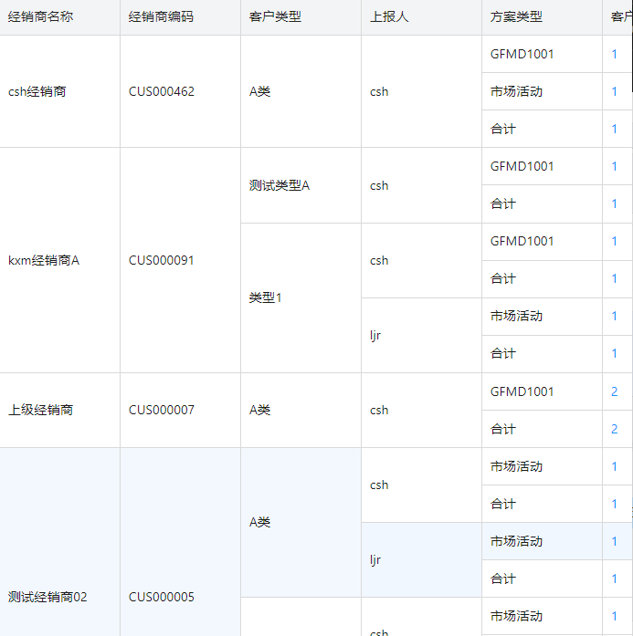

### 需求引入
在表格业务中，在一列上会出现多个内容相同的连续相邻单元格，需要将连续的单元格合并为一行。

比如某表格数据记录如下：
```js
const rows = [
    {id: 1, name: '张三', age: 18, height: 172},
    {id: 2, name: '李四', age: 18, height: 180},
    {id: 3, name: '王五', age: 20, height: 180},
]
```
我们需要合并age列和height列中相同的单元格
### 实现思路
首先我们需要在表格的每条数据记录中去添加额外字段，每有一个要合并的属性都对应了一个额外字段。
额外字段用于表示从当前行开始一共有多少行的属性和当前行是一样的。

比如对于上面的表格数据记录例子来说，我们要将其变成下面的数据结构：
```js
const rows = [
    {id: 1, name: '张三', age: 18, height: 172, belowSameAge: 2, belowSameHeight: 1},
    {id: 2, name: '李四', age: 18, height: 180, belowSameAge: 0, belowSameHeight: 2},
    {id: 3, name: '王五', age: 20, height: 180, belowSameAge: 1, belowSameHeight: 0},
]
```

我们可以在列配置的onCell属性中去设置rowSpan去表示当前行要占几行，但注意在这行下方的列配置中，rowSpan的值需要设置为0，否则下面的行不会直接被合并，而是会出现错位现象.

这就是额外字段的作用，它们就是rowSpan参数的值：
```js
const ageColConfig = {
    ...others,
    dataIndex: 'age',
    onCell: (record) => {
        return {rowSpan: record.belowSameAge}
    }
}
```
#### 双指针算法计算额外字段的值
我们将 原始表格记录数组 --> 增加了额外字段后的表格记录数组 这部分代码逻辑抽离为下面的函数，我们会在DataGrid的onLoadSuccess的回调函数中去调用它。
``` js
/**
 * @description 用于辅助合并表格中某些列中内容相同的连续相邻单元格
 * @param {array} data - 请求返回的表格rows数据，对象数组
 * @param {array} props - 需要被合并的列名称数组
 * @returns {array} - 为每个对象元素增加了辅助属性后的数组，辅助属性可以直接设为rowSpan
 */
export default function handleMergeRows(data, props) {
  const mergeData = props?.reduce((data, prop) => {
    //表示连续的内容相同的单元格区域的左侧指针
    let curStartIndex = 0
    //为每个对象添加辅助属性，如果是连续区域的第一个单元格，属性值为其下相同单元格个数，赋给rowSpan参数
    let helpCountProp = `below_same_${prop}`

    data[curStartIndex] && (data[curStartIndex][helpCountProp] = 1)

    //开始遍历，移动右指针，右指针遇到不同的元素时，移动左指针到右指针，为当前元素重新开始计数了
    data.forEach((item, index) => {
      if (index > 0 && item && data[index - 1] && item[prop] !== data[index - 1][prop]) {
        curStartIndex = index
        item[helpCountProp] = 1
      } else if (curStartIndex !== index) {
        //如果当前元素和前一个都相等，则当前元素的辅助计数属性为0，因为需要被覆盖，而左指针位置元素的辅助属性计数+1
        item[helpCountProp] = 0
        data[curStartIndex][helpCountProp]++
      }
    })
    return data
  }, data)
  return mergeData
}

```
### 一些更为复杂的场景
但在某些场景下，我们并非简单地把所有连续相邻单元格合并，如下图：





虽然上报人一列中部分连续单元格内容一致，但如果前一列客户类型对应的单元格内容不一致，那也不符合合并行的要求。即使前一列客户类型对应的单元格内容一致，但经销商编码对应的单元格内容不一致，也不符合合并行的要求。
也就是说，在合并某一列的某些行时，需要考虑“依赖属性”，因此handleMergeRows函数需要增加一个参数，用于指定依赖属性，表示只有当所有依赖属性值一致时，才允许合并。

```js
/**
 * @description 用于辅助合并表格中某些列中内容相同的连续相邻单元格
 * @param {array} data - 请求返回的表格rows数据，对象数组
 * @param {array} props - 需要被合并的列名称数组
 * @param {string} dependProps - 合并所依赖的字段
 * @returns {array} - 为每个对象元素增加了辅助属性后的数组，辅助属性可以直接设为rowSpan
 */
export default function handleMergeRows(data, props, dependProps) {
  const mergeData = props?.reduce((data, prop) => {
    //表示连续的内容相同的单元格区域的左侧指针
    let curStartIndex = 0
    //为每个对象添加辅助属性，如果是连续区域的第一个单元格，属性值为其下相同单元格个数，赋给rowSpan参数
    let helpCountProp = `below_same_${prop}`

    data[curStartIndex] && (data[curStartIndex][helpCountProp] = 1)

    //开始遍历，移动右指针，右指针遇到不同的元素时，移动左指针到右指针，为当前元素重新开始计数了
    data.forEach((item, index) => {
      let dependPropChange = 0 //依赖的属性是否变化
      dependProps.forEach((p)=>{
        if(index > 0 && item && data[index - 1] && item[p] !== data[index - 1][p]) dependPropChange = 1
      })
      if (
        (index > 0 && item && data[index - 1] && item[prop] !== data[index - 1][prop]) ||
        (index > 0 && item && data[index - 1] && dependPropChange)
      ) {
        curStartIndex = index
        item[helpCountProp] = 1
      } else if (curStartIndex !== index) {
        //如果当前元素和前一个都相等，则当前元素的辅助计数属性为0，因为需要被覆盖，而左指针位置元素的辅助属性计数+1
        item[helpCountProp] = 0
        data[curStartIndex][helpCountProp]++
      }
    })
    return data
  }, data)
  return mergeData
}

```


