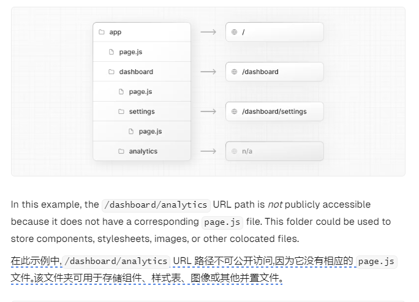

### 背景
在前端开发中每新建一个业务功能页面，都要在路由配置文件中手动添加一条路由配置，属于机械重复工作

### 主流方案：约定式路由
约定式路由即根据文件目录去自动生成路由，在许多框架中都有这种实现，如umi、next.js等

如果要在react或vue项目中自行实现约定式路由，可以用构建工具提供的api如webpack中的require.context、vite中的import.meta.glob去获取页面目录下的所有文件路径，经过一些处理后得到路由配置的内容

vite文档参考：https://cn.vitejs.dev/guide/features#glob-import

但在实际开发中，pages下很多文件是不需要生成对应路由的，如components、utils、assets等文件夹

我想过去写一些约定之外的配置文件，比如在生成路由时通过读json配置来排除这些文件夹，类似tsconfig中的exclude字段
但无法保证这些不需要生成对应路由的文件夹名称可以被穷举，因此通过手动配置去排除的方式也不可行，也违背了“约定大于配置”的原则

next.js针对这种情况的做法是对我们的页面文件目录再添加一些约定：

这样不管文件夹名称是什么，只要里面没有page.js，就能知道无需生成对应路由

考虑到我们目前的项目已经基于配置式路由开发了很长时间，迁移至约定式路由成本会很高，可能超过了约定式路由简化开发效率的收益，因此我希望在不改变配置式路由以及原先项目中routes文件夹结构的前提下，用脚本自动化写入的方式来节省开发人员的时间并杜绝一些低级错误，这种想法刚好也符合“渐进式”的概念

### 一种渐进式路由自动化生成方案
我们在项目package.json中添加一个命令xxx，去运行一个node脚本，脚本中会启动chokidar的watcher监听pages目录
开发者在需要创建路由时，先npm run xxx，然后新建文件夹，这时候监听到最新的文件路径，进行一系列处理后自动写入最新创建页面的路由配置。之后，用一个定时器去控制在一定时间后没有新建的操作了就杀掉watcher

路由懒生成的方案中其实也隐含了另外两条约定：

- 如果你新建的是一个需要对应至路由的功能文件夹，那只要提前敲一个npm run xxx去唤醒路由自动创建流程；
- 如果你只是新建一个无需对应至路由的文件夹，如只是在当前页面存放组件的components目录或者存放接口请求的api目录，那就不需要去执行这个命令，自然不会生成多余的路由配置

因此我们同样不需要额外配置哪些文件目录不需要对应到路由上去，而是由开发者在新建目录时决定即可

