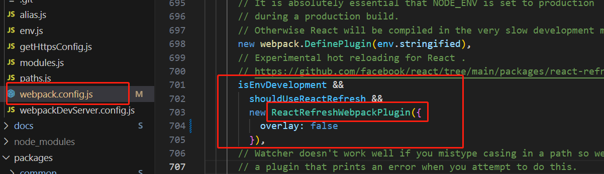
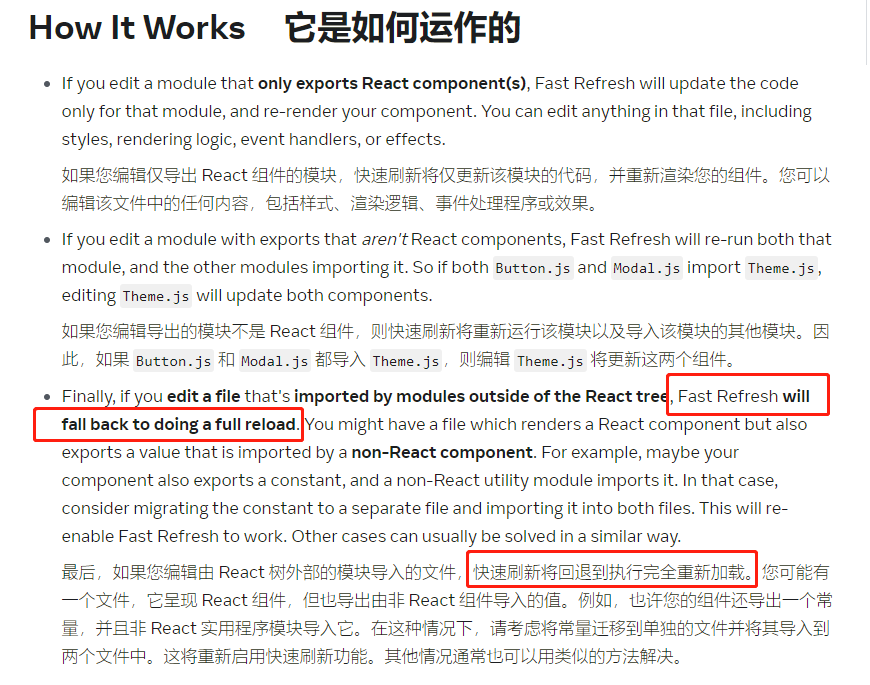
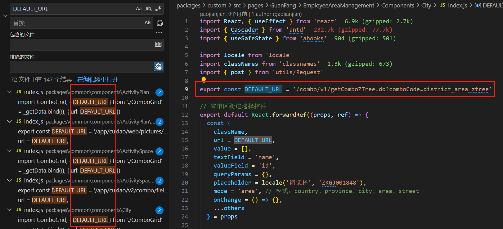

### cra项目中热更新为什么会出现全量刷新而不是局部热替换？
先说结论
1. 不是哪边没配置或者配置错了导致的问题，cra内置的热更新原理就是会在某些情况下全量刷新
2. 下面我的排查过程中的前两步都是弯路，省流可跳过直接看第三步
### 排查过程
一开始我对热更新的理解是修改了文件内容之后只会刷新跟修改内容相关的部分，也就是局部热替换；但是在公司的cra项目中都是整个浏览器页面全量刷新，速度非常慢

#### 第一步：对比公司项目和cra的默认webpack配置

我npx create-react-app创建一个项目my-app，没有改动任何默认的webpack配置，测试了一下确实会局部热替换不重刷页面，我怀疑是否公司的cra项目里加了什么配置导致局部热替换失败

在my-app中npm run eject之后我把cra的默认webpack配置和公司项目的webpack配置对比了下，公司项目确实加了一部分东西，但没有和热更新相关的改动；热更新用的还是cra中内置的ReactRefreshWebpackPlugin

npm start时也验了这张图中ReactRefreshWebpackPlugin的前两个变量都是true，说明ReactRefreshWebpackPlugin是正常启用的

#### 第二步：排除联邦模块影响的可能性

之前在项目中使用联邦模块会导致热更新完全失效（既没有局部热替换也没有全量刷新），然后在dev阶段引入了一个全量刷新的插件进行全量刷新

但即使将联邦模块和全量刷新的插件全部注释后依然不会出现局部热替换

#### 第三步：检索ReactRefreshWebpackPlugin的热更新原理

ReactRefreshWebpackPlugin在webpack的插件文档里没有，是react native推出用来替换原来的React Hot Loader的，其背后的概念是Fast Refresh，是针对react开发时的热更新解决方案（Fast Refresh实现平台无关，也适用于Web环境）

有关Fast Refresh的文档链接为https://reactnative.dev/docs/fast-refresh

在这里讲述了其运作原理，重点是第三点中，“快速刷新将回退到执行完全重新加载”，说明在某些情况下，ReactRefreshWebpackPlugin就是会放弃局部热替换的策略

我在之前创建的项目my-app中简单测试了下，如果在App组件中export const a = 1，也无需在其他地方引入，再次修改App组件时就会出现重刷整个页面

而在公司项目中确实存在这种除了导出React组件之外还导出了常量的情况

后来发现注掉routes的index.js中某些导入的路由文件之后，可以实现局部热替换，目前原因未知
