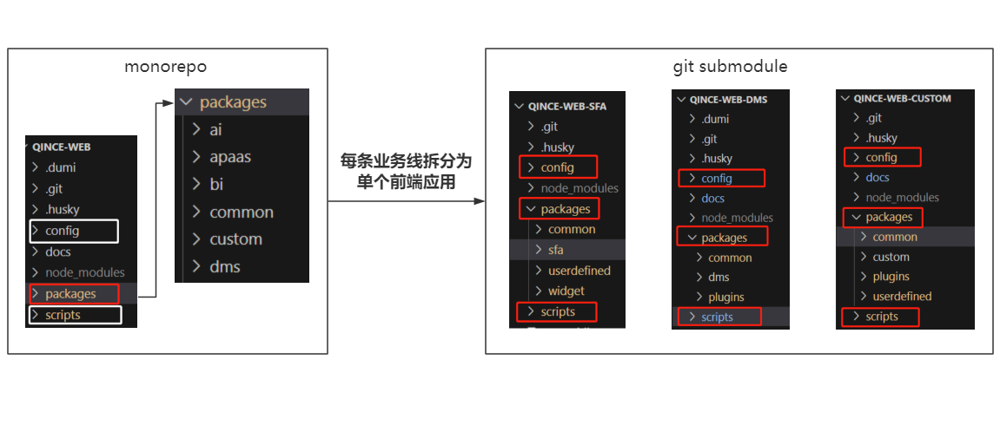

### 架构升级


monorepo的弊端在于，多个关系并不紧密的业务模块都在同一仓库中，git提交记录不够清晰，且若在回滚出现意外丢失代码情况，可能涉及多个业务模块，造成更大影响

针对原先使用lerna进行管理的巨型monorepo进行升级，将每条业务线拆分为单个前端应用；

而每个独立应用内部仍保留多包结构，在packages下通过git submodule引入scripts（自动化脚本模块）/ config（打包配置模块）/ common （内部组件库）等需要共享的仓库

示意图如下：




### 添加子模块 
```
git submodule add http://172.31.3.22:10086/web/sfa/qince-web-sfa.git packages/sfa
```

### 子模块的使用
工程clone下来之后引入的submodule都是空文件夹。需要在项目根目录执行如下命令完成子模块的下载：
```
git submodule init
git submodule update
```
或：
```
git submodule update --init --recursive
```

### 查看子模块
```
git submodule
```

### 子模块的更新
子模块的维护者提交了更新后，使用子模块的项目必须手动更新才能包含最新的提交。
在项目中，进入到子模块目录下，执行git pull更新，查看git log查看相应提交。
完成后返回到项目目录，可以看到子模块有待提交的更新，使用git add，提交即可。

### 删除子模块
有时子模块的项目维护地址发生了变化，或者需要替换子模块，就需要删除原有的子模块。
删除子模块较复杂，步骤如下：
```
git rm --cached 子模块名称
```
```
rm -rf 子模块目录
```
然后从.gitmodules文件中删除相关行
```
[submodule "path_to_submodule"]
    path = path_to_submodule
    url = https://github.com/path_to_submodule
```
从.git/config中删除相关部分
```
[submodule "path_to_submodule"]
    url = https://github.com/path_to_submodule
```
删除模块下的子模块目录，每个子模块对应一个目录，注意只删除对应的子模块目录即可
```
rm -rf .git/modules/path_to_submodule
```
最后如需安装最新的子模块，继续重复以上新增步骤：
```
git submodule add https://github.com/path_to_submodule path_to_submodule
```

