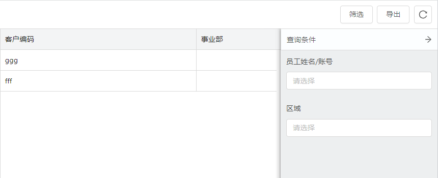
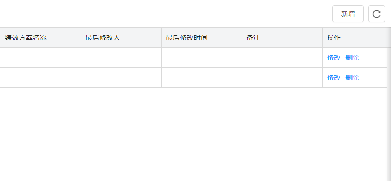
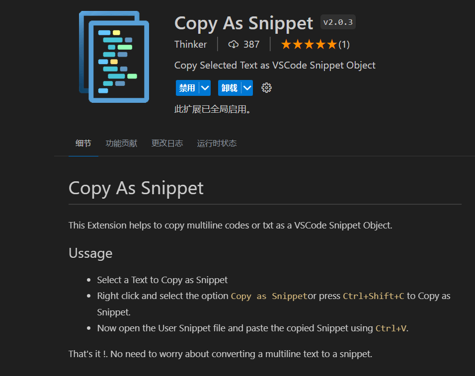

介绍了工作中大量可复用的代码逻辑，保存于vscode本地代码片段之中。
## 代码骨架模板
用于生成表格/弹窗代码的基本骨架。使用这些代码片段时请注意：
1. 修改函数组件名称与你的实际page名一致
2. 修改函数组件上方页面注释
3. 因主要本地自用，代码逻辑带有个人风格，或是存在一些未完善的细节
### 基础表格
- 命令：` table-b ` （base）
- 除刷新外无任何额外功能

### 筛选-导出表格
- 命令：` table-fe ` （filter-exp）
- 仅包含筛选/导出功能的表格
- 效果图：



### 增删改表格
- 命令：` table-cdu `（create-delete-update）
- 仅包含增删改功能表格，查询功能放在常用工具控件的代码片段中了，按需添加
- 效果图：



- 配套命令：` dia-cu `（dialog-create-update）
用于生成增删改表格所需要的新增/修改的弹窗代码文件内容
### 命令总览
| prefix | 描述 |
| ---- | ---- |
| table-base | 除刷新外无任何额外功能的表格 |
| table-cdu | 仅包含增删改功能表格 |
| table-fe | 仅包含筛选/导出功能的表格 |
| dia-cu | 新增/删除的弹窗（与增删改功能表格配套使用） |

## 表格中常用工具控件的代码逻辑
在表格业务的基本骨架上，根据实际需求，快速添加常用的工具控件代码逻辑

### 命令总览

| prefix | 描述 |
| ---- | ---- |
| dpy | 添加年份日期选择器/相关状态和onChange函数/禁用未到日期 |
| dpq | 添加季度日期选择器/相关状态和onChange函数/禁用未到日期 |
| dpm | 添加月份日期选择器/相关状态和onChange函数/禁用未到日期 |
| dpr | 添加范围日期选择器及下方快捷选项/相关状态和onChange函数 |
| exp | 添加导出按钮/handleExport函数 |
| exp-c | 添加导出按钮/导出勾选列弹窗/handleExport函数 |
| imp | 添加导入按钮/导入弹窗组件及状态/handleImportSuccess函数 |
| fil | 添加右侧筛选弹窗及状态/handleReset&handleFilter函数 |
| sea | 添加搜索框/搜索值状态/handleSearch函数 |
| bat | 添加批量勾选框/批量确认按钮/handleBatch函数 |
| cbox | 添加ComboBox/相关状态和onChange函数 |
| sum | 添加表格总结栏 |
| dia | 添加弹窗组件/弹窗组件状态|
| col-s | 添加列筛选配置 |
| sel | 添加antd select控件/相关状态和onChange函数 |
| che | 添加antd checkbox控件/相关状态和onChange函数 |


## FormItem组件
快速生成常用的表单项控件，包含ant design中常用数据录入组件以及复杂业务组件。
以下快捷命令中fi为Form Item的缩写

### 命令总览

| prefix | 描述 |
| ---- | ---- |
| fii | 文本输入框表单项 |
| fin | Number输入框表单项 |

| ficus | 客户类型下拉组件 |
| fidea | 经销商下拉组件 |


## React相关
在vscode中已有很多这部分的插件，因此自定义的react代码片段并不多

### 通过剪贴板内容生成对应的state声明语句
- 命令：` state `

当前复制内容为`queryParams`时，可生成以下语句：
``` jsx
const [queryParams, setQueryParams] = useState(|) // 查询参数
```
能够解决每次都要改一个大写字母的不便。

### 根据剪贴板内容用useEffect进行调试
- 命令：` eff `

当前复制内容为`savedColumns`时，可生成以下语句：
``` jsx
useEffect(()=>{
  console.log(savedColumns,'savedColumns')
},[savedColumns])
```
在遇到bug时调试时，需要监听某个变量变化时会比较实用。

## utils
快速生成一些工具函数逻辑，其它一些常用的零碎片段也归在此类中

### 命令总览

| prefix | 描述 |
| ---- | ---- |
| apt | 添加页签的相关逻辑 |
| dise | eslint-disable-line注释 |
| rlink（render-link） | 列配置中渲染Typography.Link |
| rbool（render-bool） | 列配置中渲染布尔值显示逻辑 |
| rmenu（render-menu） | 列配置中渲染 |
| coli（column-index） | 列编号配置 |


## 附录1：快速编写代码片段的方式
1. 使用vscode插件


安装后，选中代码右击菜单Copy as Snippet Body或Copy as Snippet Object，会直接将选中代码复制为本地代码片段的格式，不需要自己去写多行字符串

2. 使用网页版生成工具
`https://snippet-generator.app/`

## 附录2：代码片段踩坑
代码片段body中如果包含模板字符串，有${}这样的变量占位符，则会出现丢失${}的问题
可以用两个转义符\\处理$：
``` json
  "addPageTab": {
    "prefix": "apt",
    "body": [
      "import Fh from 'utils/Fh'",
      "import { useHistory } from 'react-router'",
      "const history = useHistory()",
      "Fh.addPageTab({",
      "  id: `\\${menuId}-detail-inspection`,",
      "  title: locale('绩效方案设置'),",
      "  url: `/guanFang/meritRuleConfig?menuId=\\${menuId}`,",
      "  history",
      "})"
    ],
    "description": "addPageTab"
  },
```