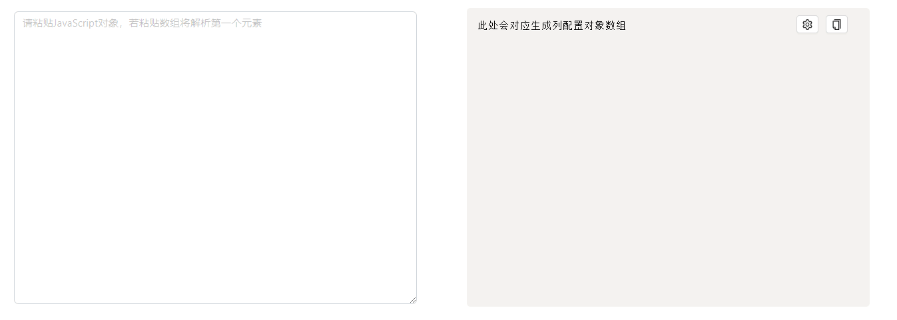

### 背景
在表格数据渲染这一最为常见的业务场景中，我们需要根据接口返回的每条数据记录的字段名去写columns配置。

但当某个业务中字段数量多达好几十时，复制字段名到columns配置中变成了一项耗时且机械的工作。因此考虑开发一款小工具，目前功能如下：
- 粘贴接口返回的JSON数据后，自动转为columns配置，支持一键复制
- 以表单形式批量配置columns中基础属性
### 效果



### 技术点
- 使用react-syntax-highlighter库实现代码块
- 使用react-copy-to-clipboard库实现一键复制
- 使用下面代码将序列化之后的数据格式化，并去除JSON中属性的双引号
```javaScript
JSON.stringify(cols, null, 2).replace(/"([^"]+)":/g, "$1:"); //指定第二个参数 null 表示使用默认的 replacer 函数，第三个参数 2 表示每个层级缩进两个空格。
```
- 在函数序列化时出现了问题